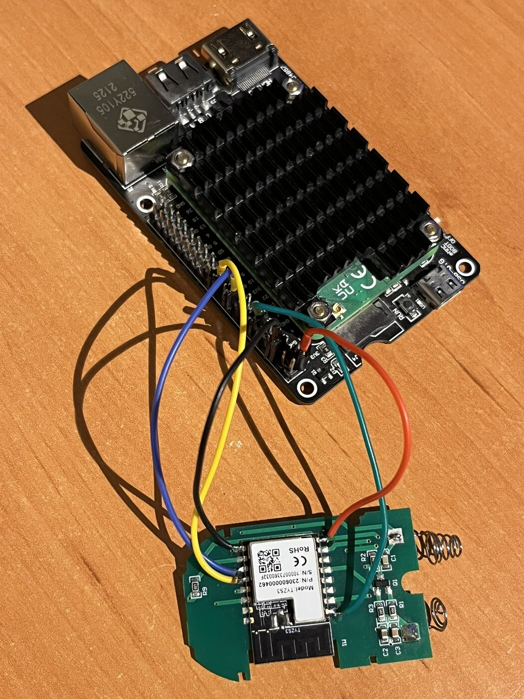
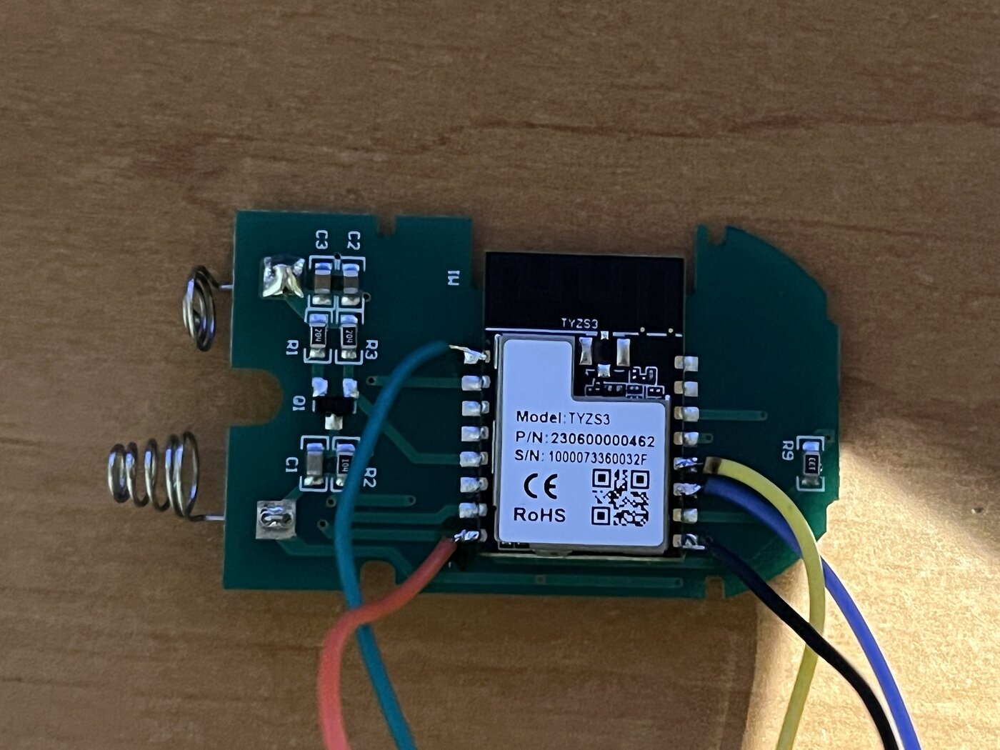

# Flashing

> **Tested only on a Raspberry Pi 4 / CM4.** Other SWD adapters will likely
> work but are untested with the instructions below.

## What you need

- A Raspberry Pi (4 or CM4) with its GPIO header wired to the TYZS3 module's
  SWD pads (see wiring below).
- A **patched build of OpenOCD** — the stock `efm32` driver refuses to write
  the EFR32's bootloader information block, so a small patch and rebuild is
  required (see below).
- The built firmware images: the application `.hex`/`.s37` and the
  bootloader `-combined.s37` — see [docs/BUILD.md](docs/BUILD.md) for exact
  paths.

## Wiring

| TYZS3 pad | Raspberry Pi CM4 header |
|---|---|
| 11 — SWDIO | GPIO24 — physical pin 18 |
| 12 — SWCLK | GPIO25 — physical pin 22 |
| 9 — GND | physical pin 6 (GND) |
| 8 — VCC | physical pin 1 (3V3) |
| 1 — nRST | (optional) GPIO18 — physical pin 12 |

Overall setup — the TYZS3 remote PCB wired with jumper wires to a Raspberry
Pi CM4 IO board:



Close-up of the SWD wires soldered to the TYZS3 module pads:



## OpenOCD configuration

The adapter and target configuration lives in
[`tools/efr32.cfg`](tools/efr32.cfg). Copy it to the Pi as `~/efr32.cfg` (the
scripts in `tools/` look for it there by default, or point them at another
path with `OPENOCD_CFG=/path/to/efr32.cfg`):

```
adapter driver linuxgpiod
adapter gpio swclk 25 -chip 0
adapter gpio swdio 24 -chip 0
transport select swd
adapter speed 400
source [find target/efm32.cfg]
flash bank bootloader efm32 0x0FE10000 0 0 0 efm32.cpu
```

## Patching OpenOCD (required)

The stock `efm32` NOR flash driver in OpenOCD has no concept of the EFR32's
bootloader information block at `0x0FE10000`, and refuses to write to it.
To flash the Gecko bootloader over SWD, OpenOCD has to be patched and built
from source. All four edits are in `src/flash/nor/efm32.c`:

1. Near line 58, add a define for the bootloader region, right below the
   `EFM32_MSC_LOCK_BITS_EXTRA` define:

   ```c
   #define EFM32_MSC_BOOTLOADER (EFM32_MSC_INFO_BASE + 0x10000)
   ```

2. In `enum efm32_bank_index`, add a new bank index immediately before
   `EFM32_N_BANKS`:

   ```c
   EFM32_BANK_INDEX_BOOTLOADER,
   ```

3. In `efm32_get_bank_index()`, add a case for the new region before the
   `default:` case:

   ```c
   case EFM32_MSC_BOOTLOADER: return EFM32_BANK_INDEX_BOOTLOADER;
   ```

4. In `efm32_probe()`, right after the block that sizes main flash, add a
   branch that sizes the bootloader region — it's a fixed 16 KB:

   ```c
   else if (bank->base == EFM32_MSC_BOOTLOADER) {
       page_size = efm32_mcu_info->page_size_ud;
       bank->num_sectors = 16384 / page_size;
   }
   ```

Then build it on the Pi:

```sh
sudo apt update && sudo apt install libjim-dev libgpiod-dev
```

(Installing `jimtcl` system-wide avoids OpenOCD's internal jimtcl submodule
build failing; `libgpiod` is needed for the bit-bang SWD driver.)

```sh
./bootstrap
./configure --enable-linuxgpiod
make -j4
sudo make install
```

## Flashing with `tools/flash.sh`

Copy `tools/flash.sh` and the built images onto the Pi, then run **`backup`
first** — it dumps the stock firmware so you can restore it later if you
ever want to go back:

```sh
./flash.sh backup
```

This writes `stock_main.bin`, `stock_userdata.bin`, `stock_lockbits.bin`,
and `stock_btl.bin` into a fresh `backup-<timestamp>/` directory. Nothing
else in the script creates a backup automatically.

Subcommands:

| Command | What it does |
|---|---|
| `check` | Tests the SWD link — halts the chip, reads memory, resumes. Good first sanity check. |
| `backup` | Full dump of main flash, user data page, lock bits, and the bootloader region. Run this first. |
| `app [file.hex]` | Erases, flashes, and verifies the application image, then reboots. |
| `boot [file.s37]` | Flashes and verifies the Gecko bootloader into the bootloader region, then reboots. |
| `all` | Flashes bootloader and application in a single OpenOCD session. |
| `verify [file.hex]` | Verifies flash contents against the given image without writing anything. |
| `restore [main.bin]` | Writes a stock main-flash dump (from `backup`) back — the undo path. |

The script re-execs itself under `sudo` automatically, since GPIO bit-banging
needs root. Image filenames default to
`Zigbee-Remote-_TYZB01_7qf81wty.hex` and
`bootloader-storage-internal-single-512k-combined.s37` in the current
directory; override with `APP_IMG=` / `BOOT_IMG=` if yours are named or
located differently.

The flash memory map that these commands write into is documented in
[docs/BUILD.md](docs/BUILD.md#flash-memory-map-efr32mg13p732f512gm48-512-kb).

**OTA "apply" needs the bootloader flashed.** The application boots and
runs fine on its own, but it can only download an OTA image — it can't
verify and apply one without the Gecko bootloader present at `0x0FE10000`.
Run `flash.sh boot` (or `all`) at least once so OTA updates can actually
install.

## Debugging with `tools/debug.sh`

| Mode | What it does |
|---|---|
| `uart [baud]` | Watches the firmware's serial debug log over UART. Default mode — doesn't attach a debugger, so it doesn't disturb real EM2 sleep behavior. |
| `gdb` | Starts OpenOCD as a persistent GDB/telnet server for breakpoints and memory inspection from your PC. |
| `rtt` | Streams SEGGER RTT output over SWD (only works if the firmware was built with RTT logging enabled). |

UART wiring (one extra jumper beyond the SWD harness — GND is already
shared):

| TYZS3 pad | Raspberry Pi CM4 header |
|---|---|
| 16 — TXD | physical pin 10 (GPIO15, UART RX) |
| 15 — RXD (optional, two-way) | physical pin 8 (GPIO14, UART TX) |

One-time Pi serial setup (reboot afterward):

```sh
sudo raspi-config
# Interface Options -> Serial Port
#   "login shell over serial?"        -> No
#   "serial port hardware enabled?"   -> Yes
```

If `/dev/serial0` still doesn't exist after that (common on CM4 boards with
onboard Bluetooth), add to `/boot/firmware/config.txt`:

```
enable_uart=1
dtoverlay=disable-bt
```

**Note:** the shipped firmware has logging disabled and no RTT/CLI console
by default (see `DEBUG_LOGGING` in [docs/BUILD.md](docs/BUILD.md)) — you'll
need to rebuild with debug components enabled to get output from `uart` or
`rtt` mode.
