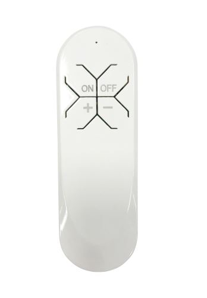

# TS1001_TYZB01_7qf81wty_Enhanced — Open Firmware for the Immax NEO Smart Remote v2



TS1001_TYZB01_7qf81wty_Enhanced is a from-scratch, open-source replacement firmware for the
**Immax NEO Smart Remote v2**, a four-button Zigbee 3.0 handheld remote built
around a Tuya **TYZS3** module (Silicon Labs **EFR32MG13**). The stock
firmware is locked to Tuya's cloud-oriented data model; this firmware
replaces it entirely with a fully local implementation designed to work
cleanly with **Zigbee2MQTT** — no cloud, no gateway, no proprietary clusters.

Instead of hardcoding a target device, every button action is sent as a
standard Zigbee Cluster Library command through the device's **binding
table**. Bind it to a light, a group, or both, and it just works — the
same way any well-behaved Zigbee remote should.

<br clear="right">

## Features

- **Four buttons** — ON, OFF, PLUS, MINUS — with click, hold, double-click,
  and double-hold gestures.
- **Standard ZCL commands** (On/Off, Level Control Step/Move, Color Control)
  sent via bindings — works against individual lights and groups
  simultaneously.
- **Non-blocking LED feedback** for every action, pairing, and OTA activity.
- **Battery voltage and percentage reporting** over the Power Configuration
  cluster.
- **Offline action cache** — button presses made while the coordinator is
  unreachable are coalesced and replayed once the network comes back.
- **Sleepy End Device** operation (deep sleep between events) for long
  battery life on 2×AAA cells.
- **Over-the-air updates** with a hosted image index Zigbee2MQTT can poll.

### Gestures

| Button | Click | Hold | Double-click | Double-hold |
|---|---|---|---|---|
| **ON**  | Turn on | — | — | — |
| **OFF** | Turn off | — | — | — |
| **PLUS**  | Brightness step up | Brightness ramp up (while held) | Color temperature step cooler | Color temperature sweep cooler (while held) |
| **MINUS** | Brightness step down | Brightness ramp down (while held) | Color temperature step warmer | Color temperature sweep warmer (while held) |

ON and OFF are single-function buttons — click is their only gesture.

### LED feedback

| Event | LED behavior |
|---|---|
| On sent | 1 short blink |
| Off sent | 2 short blinks |
| Brightness step/ramp | Fast blink pattern while active |
| Color-temperature step/ramp | Slow blink pattern while active |
| Pairing window open | Continuous fast blink |
| OTA check/download in progress | Slow "breathing" glow |
| Idle | LED off (device asleep) |

## Quick start

1. **Flash the firmware.** See [FLASHING.md](FLASHING.md) for wiring, tools,
   and step-by-step flashing instructions.
2. **Pair.** Hold **ON + OFF for 15 seconds** until the LED blinks quickly —
   this resets the device and opens a 30-second join window. Put your
   coordinator into pairing mode first.
3. **Install the Zigbee2MQTT converter.** Copy
   [`z2m/ts1001-tyzb01-enhanced.js`](z2m/ts1001-tyzb01-enhanced.js) into Z2M's
   `external_converters` folder (or reference it in `configuration.yaml`)
   and restart Z2M. The device will show up as **TS1001_TYZB01_7qf81wty_Enhanced**.
4. **Bind it.** In Z2M, bind the remote to a light and/or a group using the
   device's Bind tab. Because this is a sleepy end device, it only receives
   Zigbee requests for a couple of seconds after a button press — **press
   any button on the remote at the moment you click Bind/Configure in Z2M**
   so the request actually reaches it.

## Battery

Battery voltage and percentage are reported over the Power Configuration
cluster and show up in Z2M as the `battery` and `voltage` device attributes.
The remote measures on wake and throttles reporting so it doesn't spend
extra radio time (and battery) on a value that rarely changes quickly.

## Offline action cache

If the coordinator or the mesh is unreachable when you press a button, the
action isn't lost — it's cached in RAM and coalesced with anything else you
press before reconnecting. On the next successful network contact, the net
result is replayed automatically: one On/Off, one net brightness step, and
one net color-temperature step, in that order.

## OTA updates

Hold **PLUS + MINUS for 10 seconds** to force an immediate update check (the
LED breathes slowly while it checks and downloads); otherwise the remote
checks automatically at most once a day when it wakes. See
[`ota/README.md`](ota/README.md) for how images are built and published.

Zigbee2MQTT can be pointed directly at the hosted OTA index for this
project:

```
https://raw.githubusercontent.com/semicolonmystery/07087-2-Enhanced/main/ota/index.json
```

## Building from source

See [docs/BUILD.md](docs/BUILD.md) for the Simplicity Studio project setup,
build artifacts, flash memory map, and the full `app_config.h` tuning
reference.

## Licensing

This project's firmware is released under the MIT License — see
[LICENSE](LICENSE). It is built against the Silicon Labs Gecko SDK, which is
**not included** in this repository; install it through Simplicity Studio.
The Gecko SDK components used here, and the SDK-derived `app.c` / `main.c`
application scaffolding, remain licensed under the Silicon Labs Master
Software License Agreement per their original file headers.

## Disclaimer

This is unofficial, community-built firmware. It is not affiliated with, and
not endorsed by, Immax, Tuya, or Silicon Labs. Flashing it replaces the
device's stock firmware and is done entirely at your own risk. No warranty
of any kind is provided — see [LICENSE](LICENSE).
